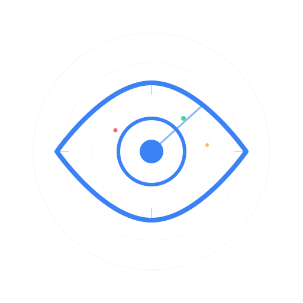

<p align="center">
  
</p>

<h1 align="center">Asaru</h1>

<p align="center">
  Visual intelligence platform for mass drone attack data from active conflicts.
</p>

<p align="center">
  <a href="https://imesli.github.io/Asaru/">Live Demo</a> ·
  <a href="#data-sources">Data Sources</a> ·
  <a href="#getting-started">Getting Started</a> ·
  <a href="https://github.com/Imesli/Asaru">GitHub</a>
</p>

---

Asaru ("watch/observe") is an open-source platform that combines a structured, machine-readable dataset of real drone attack patterns with an interactive dark-mode map visualisation. It covers 1,107 attack events and 461 reconstructed flight routes from the Russia-Ukraine and Iran-Gulf conflicts, making it the most comprehensive structured record of mass drone warfare available.

Built by [Imesli](https://github.com/Imesli), a UK defence tech company building open tools for automated drone defence.

## Live Demo

**[imesli.github.io/Asaru](https://imesli.github.io/Asaru/)**

Interactive map showing attack origins, targets, flight paths, and interception data across both conflicts. Dark-mode interface built with deck.gl and MapLibre GL.

## Features

- **Interactive attack map** -- Visualise 1,107 drone attack events across Ukraine and the Gulf on a dark-mode globe with deck.gl rendering
- **Flight path traces** -- 461 reconstructed drone routes from ground observer reports, showing the circuitous paths drones use to evade air defences
- **Sim engine** -- Replay real attacks, place your own defence sites, and test interceptor assignment algorithms against historical data
- **Structured dataset** -- Every record is machine-readable JSON with full provenance: source citations, confidence levels, and completeness metadata
- **Two active conflicts** -- Ukraine/Russia (Sep 2022 -- present, 54,000+ drones in 2025 alone) and Iran/Gulf states (Feb 2026 -- present, 2,000+ drones launched)
- **Strike vs decoy classification** -- Distinguishes between strike drones (Shahed-136, Geran-2/3) and decoy variants (Gerbera), critical for realistic simulation
- **Schema-validated** -- JSON Schema definitions with automated validation and completeness reporting

## Data Sources

| Source | Coverage | Confidence |
|--------|----------|------------|
| Ukrainian Air Force via [PetroIvaniuk/Kaggle](https://www.kaggle.com/datasets/piterfm/massive-missile-attacks-on-ukraine) | Sep 2022 -- Nov 2024 | Official, CSIS-verified |
| [ISIS Monthly Shahed Analysis](https://isis-online.org/isis-reports/monthly-analysis-of-russian-shahed-136-deployment-against-ukraine) | Jan 2025 -- Jan 2026 | Verified OSINT |
| [Shahed Tracker](https://x.com/ShahedTracker) (flight paths + nightly totals) | 2024 -- present | OSINT |
| Konrad Adenauer Foundation Air War Monitor | 2024 -- present | Verified OSINT |
| Gulf state defence ministries and CENTCOM | Feb 2026 -- present | Official (via news) |

Every record includes source citations and one of five confidence levels: `official`, `verified_osint`, `osint`, `news_report`, or `estimate`.

## Tech Stack

- **Frontend** -- React 19, Vite, deck.gl, MapLibre GL via react-map-gl
- **Data** -- JSON with JSON Schema validation
- **Validation** -- Python (`scripts/validate.py`)
- **Deployment** -- Static site on GitHub Pages

## Getting Started

```bash
# Clone the repository
git clone https://github.com/Imesli/Asaru.git
cd Asaru/src

# Install dependencies
npm install

# Start development server
npm run dev

# Build for production
npm run build

# Preview production build
npm run preview
```

### Validate the dataset

```bash
python scripts/validate.py
```

This runs schema validation against all data files and prints a completeness report showing field coverage.

## Data Schema

Two JSON Schema definitions in `schema/`:

**Attack Events** (`schema/attack_event.schema.json`) -- One record per attack event or monthly aggregate. Fields include date, duration, total drones launched, strike/decoy split, drone types and speeds, launch and target regions with coordinates, interception rates and methods, wave data, and source citations.

**Route Traces** (`schema/route_trace.schema.json`) -- Individual drone flight paths as ordered waypoint sequences with geocoded coordinates. Includes approach direction, route type (direct/circuitous/looping), and outcome (intercepted/hit_target/crashed). These are approximate transit routes through named locations -- accurate enough for simulation and algorithm testing.

## Project Structure

```
Asaru/
├── schema/                # JSON Schema definitions
│   ├── attack_event.schema.json
│   └── route_trace.schema.json
├── data/
│   ├── ukraine/           # Ukraine/Russia conflict data
│   └── iran/              # Iran 2026 conflict data
├── examples/              # Example records
├── scripts/
│   └── validate.py        # Schema validation + completeness reporting
├── src/                   # Frontend application
│   ├── src/
│   │   ├── App.jsx        # Main application
│   │   ├── MapView.jsx    # deck.gl map visualisation
│   │   └── sim/           # Simulation engine and UI
│   └── public/
│       ├── asaru-logo.svg
│       └── imesli-logo.svg
└── docs/                  # Data dictionary and methodology
```

## Contributing

Contributions welcome. The dataset grows through manual extraction from public sources:

1. **New attack events** from Ukrainian Air Force reports, ISIS monthly analyses, or news coverage
2. **Route trace data** from Shahed Tracker or monitoring channels
3. **Iran conflict data** as the situation develops
4. **Corrections** to existing records with source citations
5. **Frontend improvements** to the map visualisation or sim engine

All data contributions must include source citations and confidence levels. Run `python scripts/validate.py` before submitting to ensure schema compliance.

## Roadmap

Asaru is the first building block toward an automated interceptor assignment engine:

1. **Asaru dataset + visualisation** (current) -- Structured data and interactive map
2. **Asaru sim** (in progress) -- Replay real attacks and test assignment algorithms
3. **Asaru engine** (future) -- Automated system connecting radar tracks to interceptor launch decisions

## License

Code: [MIT](LICENSE)
Data: [CC BY 4.0](https://creativecommons.org/licenses/by/4.0/)

---

<p align="center">
  
  <br />
  Built by <a href="https://github.com/Imesli">Imesli</a> — open tools for automated drone defence.
</p>
